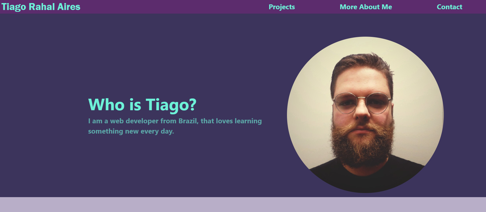

# Portfolio page

> My personal website portfolio with my projects.

## Built With

### Prerequisites

1. Internet connection
2. Web Browser

### Setup

* Enter the live version [link](https://tiagorahal.github.io/Portfolio-page/)

## Author

👤 **Tiago Rahal Aires**

- GitHub: [@tiagorahal](https://github.com/tiagorahal)
- Twitter: [@RahalAires](https://twitter.com/RahalAires)
- LinkedIn: [Tiago Rahal Aires](https://linkedin.com/tiagorahal)

## 🤝 Contributing

Contributions, issues, and feature requests are welcome!

Feel free to check the [issues page](https://github.com/tiagorahal/Portfolio-page/issues).

## Show your support

Give a ⭐️ if you like this project!

## Acknowledgments

- Thanks to freeCodeCamp and their supportive community.
- Thanks to Microverse and their supportive community.
- Thanks to Codecademy and their supportive community.

## 📝 License

This project is [MIT](./MIT.md) licensed.
